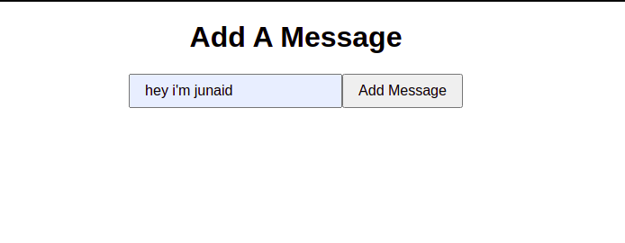

## FaunaDB with Netlify Serverless Functions, Gatsby

## Interface _(The focus is not styling)_

## Steps

- Signup on [Netlify](https://www.netlify.com/)
- run command `npm i -g yarn`
- run command `npm i netlify-cli`
- run command `gatsby new app_name https://github.com/gatsbyjs/gatsby-starter-hello-world`
- cd app_name
- create file (netlify.toml) on root
- add commands inside (as written in netlify.toml in my repo)
- Create functions
- - Open terminal
- - run command `netlify functions:create functionName` (create template)
- - pick a template (hello-world in my case)
- - run command `cd /functions/functionName` and make changes
- - run command `npm init -y; npm i faunadb`
- Navigate back to your app_name
- run command `npm i formik`
- Connect FaunaDB with Function
- - Signup to [FaunaDB](https://fauna.com/)
- - create database (click create database)
- - name your database
- - create collection (messages in my case)
- - Click security > Add secret
- - copy the link and save it in a variable in add_message function
- - initialize faunaDB (as I've done in add_message)
- - make database calls
- - return some responses
- Frontend
- - Make form template in src/pages/index.js
- - Add Data to database on Submit
- Test the app, It's working fine !!
